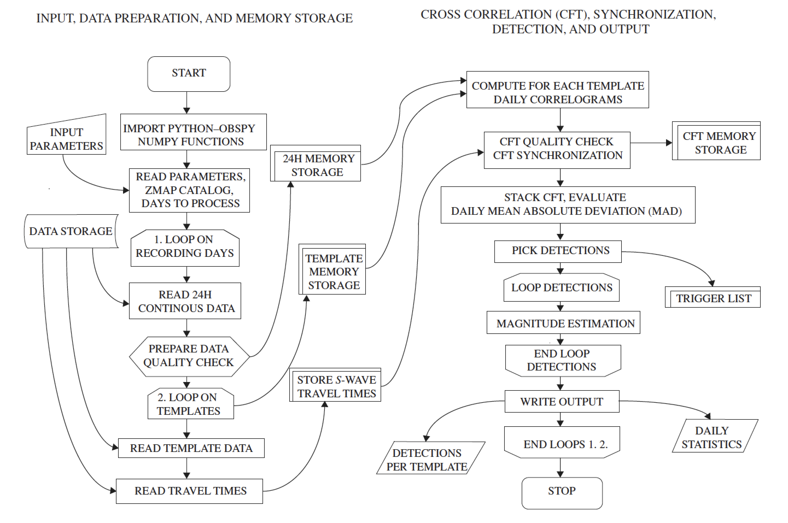

.. image:: pympa_logo1.png
    :width: 100px
    :align: left
    :alt: pympa_logo1.png
    :target: https://github.com/avuan/PyMPA37/releases

Introduction to the PyMPA package
======================================

This document is designed to give you an overview of the capabilities and
implementation of the PyMPA Python package.

Motivation
---------------
PyMPA is designed to compute detections of earthquakes, or any seismic signal
(explosions or low frequency tremors) using more advanced routines than standard
fast amplitude-ratio STA/LTA methods. 

The technique allows to augment seismic catalogs 
decreasing the completeness magnitude and is particularly useful in detecting seismicity below
the background noise level and early aftershocks of a strong mainshock. 

The basic algorithm of the PyMPA is the same as that of an MFT search for
earthquakes that resemble well-located events, termed templates (e.g., Shelly
et al., 2007; Peng and Zhao, 2009; Yang et al., 2009; Kato et al., 2012; Zhang and
Wen, 2015). The algorithm, which exploits ObsPy routines (Krischer et al., 2015), is
versatile and supports most commonly used seismic data and earthquake catalog
formats. A PyMPA flowchart is shown here below:

PyMPA is an open source project for the
development of software for the detection and analysis of earthquakes self-similar to
earthquakes. 
In addition to PyMPA, we develop other tools external
to the main code to manage the input–output preparation and
validation for (1) downloading data from Observatories and
Research Facilities for European Seismology–European
Integrated Data Archive (ORFEUS-EIDA) servers, (2) evaluating
data quality, (3) selecting earthquakes as templates
from a reference catalog, (4) trimming and filtering them
from continuous waveforms, (5) avoiding redundant detections
in the output, and (6) validating new events.
This repository will continue to grow and develop
and any modification is reported in the github repository. 

.. |github| raw:: html

    <a href="https://github.com/avuan/PyMPA37" target="_blank">github</a>

Supported environments
----------------------

Linux, OSX and Windows environments running Python 2.7 and 3.x.
We will stop support for Python 2.7 in a forthcoming release.

Functionality
-------------

Within :doc:`input </input>` you will find the routines to generate templates,
(:doc:`create_template </sub/input.create_templates>`) select good templates
(:doc:`template_check </sub/input.template_check>`), calculate travel times
(:doc:`calculate_ttimes </sub/input.calculate_ttimes>`),
compute cross-channel correlations from these templates
(:doc:`pympa </sub/main.pympa>`), process_detections 
(:doc:`process_detections </sub/output.process_detections>`), a visual verification
(:doc:`verify_detection </sub/output.verify_detection>`)

Running tests
-------------

For running tests examples are provided in the github subdirectories, tests are recalled
when modifications are performed to the codes and a TRAVIS CI report is released. 

You can also run these tests yourself locally to ensure
that everything runs as you would expect in your environment.  

Although every effort has been made to ensure these tests run smoothly on all supported environments
, if you do find any issues, please let us know on the
|github| page.

.. |github| raw:: html
    <a href="https://github.com/avuan/PyMPA37" target="_blank">github</a>        

References
----------

Shelly, D. R., G. C. Beroza, and S. Ide (2007). Non-volcanic tremor and low
frequency earthquake swarms, Nature 446, 305–307.

Peng, Z., and P. Zhao (2009). Migration of early aftershocks following the
2004 Parkfield earthquake, Nature Geosci. 2, 877–881.

Yang, H., L. Zhu, and R. Chu (2009). Fault-plane determination of the
18 April 2008 Mount Carmel, Illinois, earthquake by detecting and
relocating aftershocks, Bull. Seismol. Soc. Am. 99, 3413–3420.

Kato, A., K. Obara, T. Igarashi, H. Tsuruoka, S. Nakagawa, and N. Hirata
(2012). Propagation of slow slip leading up to the 2011 Mw 9.0
Tohoku-Oki earthquake, Science 335, 705–708.

Zhang, M., and L. Wen (2015). An effective method for small event detection:
Match and locate (M&L), Geophys. J. Int. 200, 1523–1537.

Krischer, L., T. Megies, R. Barsch, M. Beyreuther, T. Lecocq, C. Caudron,
and J. Wassermann (2015). ObsPy: A bridge for seismology into the
scientific Python ecosystem, Comput. Sci. Discov. 8, no. 1, 014003,
doi: 10.1088/1749-4699/8/1/014003.
