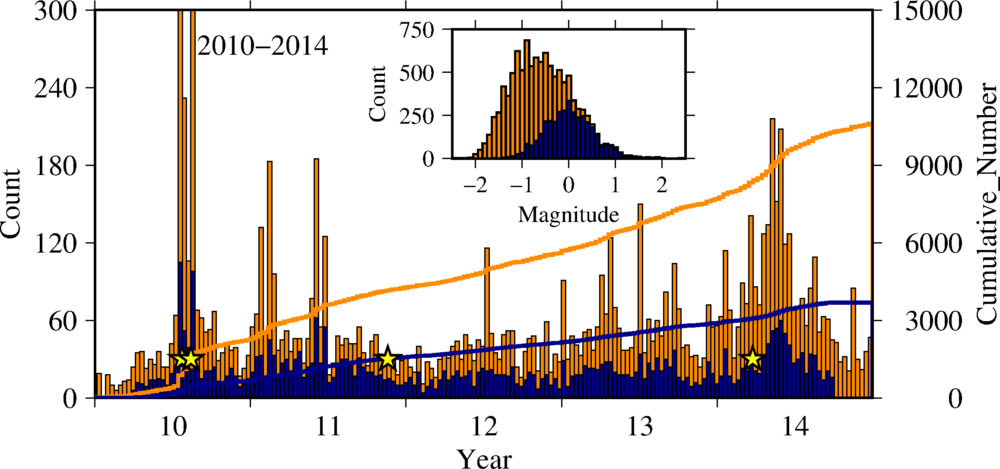
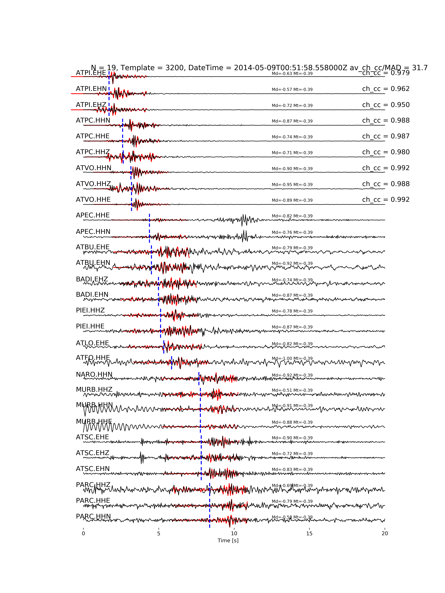

Creating an output catalog and verify detections
================================================

It consists of some separate utilities in |github|, post-processing tools to obtain a catalog and verify events.
Many events could be correlated to more than one template in a narrow time window. A fixed time window length can be selected, and within each, the template for which the normalized cross-correlation coefficient is the greates provides the event location and data to determine the magnitude.
This process is run by <./sub/output.process_detections> in to two steps, by using the last event origin time as a reference to set the next time window scrutinized. 
If template matching performs well and input data are reliable we expect you are able to increase your catalog.

Figure - 5 years template events along the Alto-Tiberina fault (blue histograms) as recorded by ATF test bed and augmented detections by PyMPA (orange). Solid lines represent the cumulative number of earthquakes. In the inset the magnitude distribution of the templates in comparison with the augmented catalog. The completeness magnitude is decreased by 0.5. Stars indicate the timing of eartquakes between magnitude 2 and 2.8. 

The final catalog should be verified by visual inspection for a number of sampled detections. Generally, we proceed by verification of events having low thresholds to understand a safe value to validate the catalog. The routine <./sub/output.verify_detection> creates graphs of time windows where continuous data and trimmed templates are plotted with info grasped from channel by channel cross-correlation process.

Figure - Visual inspection of a repeater with an average cross-correlation value of 0.98 along the Alto-Tiberina fault. Seismic data from ATF test bed (black waveforms) and a template (red) are overlapped. On the left of the panel, we list the station and channel codes, and on the right the corresponding value of cross-correlation between the two events. The template event (a magnitude M=-0.4) allows to detect a M=-1.0 repeater. 

Important: we recommend to use an updated version of |ObsPy|.
 
.. |ObsPy| raw:: html

  <a href="https://github.com/obspy/obspy/wiki" target="_blank">ObsPy</a>

.. |github| raw:: html

  <a href="https://github.com/avuan/PyMPA37" target="_blank">github</a>

These utilities contains:

* :doc:`Postprocessing routines <./sub/output.process_detections>`;
* :doc:`Visual verification of detections <./sub/output.verify_detection>`;

This package is written by the PyMPA developers, and is distributed under the LGPL GNU Licence, Copyright PyMPA developers 2019.

Contents:
---------
.. toctree::
   :maxdepth: 2

   output.process_detections <./sub/output.process_detections>
   output.verify_detection <./sub/output.verify_detection>

