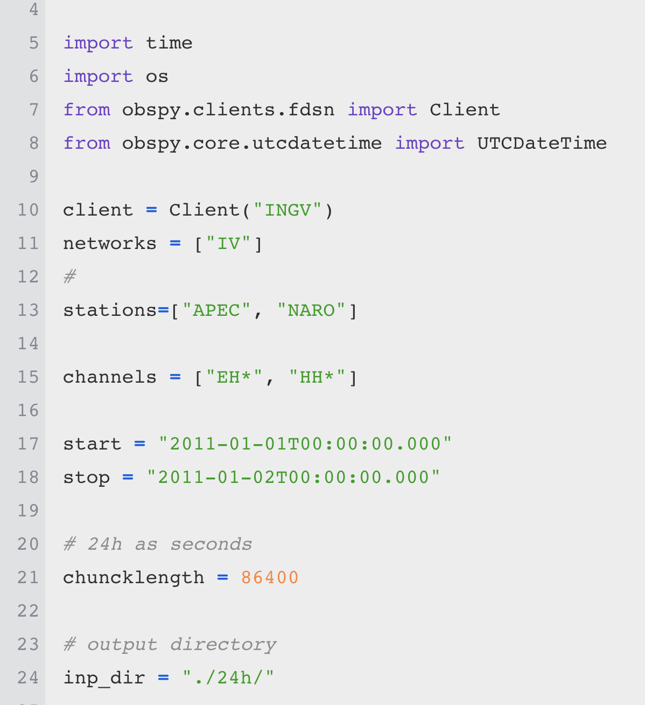

Download data
*************

Downloading data from EIDA servers is easily performed by using ObsPy tools
and routines. Please see the scripts at https://github.com/avuan/PyMPA37/blob/master/input.download_data.dir/

download_data.py and download_inventory.py allows downloading continuous data and inventories for the selected stations
and time period.

For some networks or stations please check before data availability or if there are some restrictions and a token
or userid is needed. Some EIDA servers when receiving from the same user many requests in a short time
close the door to the user. That is the reason why we introduced a pause command in our scripts, this avoids
the shutdown of the connection.
 

