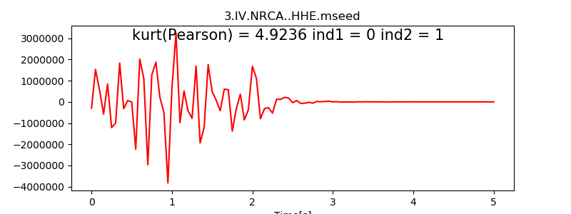
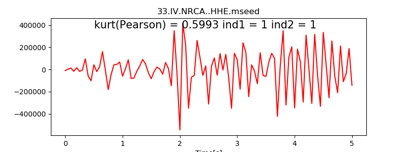
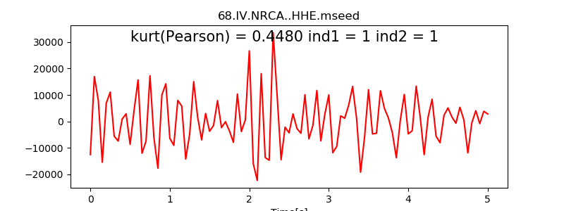
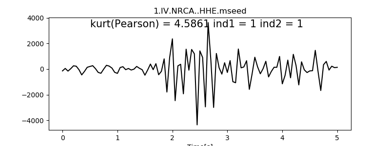
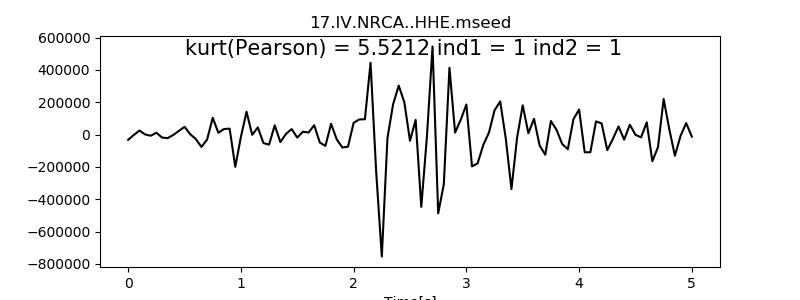

Tutorial
======================================

This tutorial is designed to give you an overview of the capabilities and
implementation of the PyMPA Python package.

Downloading Seismological Data
------------------------------
To download seismological data from EIDA (European Integrated Data Archive) servers: 
Data from broad band seismic stations are available 
from many European Institutions. To download seismological data from EIDA (European Integrated Data Archive) servers
and inventory data in STATIONXML format many examples can also be found in ObsPy.

PyMPA requires, continuous data and stations inventories.
EIDA servers can easily release data from permanent networks and the corresponding 
inventories. The examples in the subdirectory input.download_data.dir show the python scripts
that allows the download. 

In the case your data come from other sources, PyMPA through ObsPy libraries
is able to manage most of the seismological data formats (MSEED, SAC, SEISAN, SEGY, etc..). 
An inventory data file including station information needs to be created by modifying an existing 
StationXML file.

PyMPA does not use databases and prefers to store single channel daily continuous data in archieves or subdirectories.

Executable files:

- download_data.py (https://github.com/avuan/PyMPA37/tree/master/input.download_data.dir/download_data.py)
- download_inventory.py (https://github.com/avuan/PyMPA37/tree/master/input.download_data.dir/download_inventory.py)

(:doc:`download_data </sub/input.download_data>`) download data

Create Templates
----------------
(:doc:`create_template </sub/input.create_templates>`) create templates

A Python script create_templates.py is used to trim templates from continuous data and inventories
stored in an archive. Generally, we use travel times to cut events before and after S-wave arrivals.
Thus, a reference 1D velocity model is needed. Trimmed waveforms have to be carefully checked to evaluate 
the effectiveness of S-wave travel time calculations. 
Take care that a high sampling rate could result in memory consumption
and prolonged times of execution. 
Input data should be decimated a priori accordingly with your needs and availability of cores.
Check the example for running create_templates.py at https://github.com/avuan/PyMPA37/tree/master/input.create_templates.dir 

Executable file:

- create_templates.py (https://github.com/avuan/PyMPA37/tree/master/input.create_templates.dir/create_templates.py)

Input parameters:

.. include:: ../../input.create_templates.dir/trim.par
   :literal:

Note that input and output file names, inventories, template catalogs, velocity models are recalled also in the next steps. 
  

Check Template Quality
----------------------
(:doc:`template_check </sub/input.template_check>`) select good templates

Evaluating template quality allows to input only a good signal to noise ratio avoiding artifacts resulting in unwanted detections. The selection is based on Kurtosis method (https://docs.scipy.org/doc/scipy/reference/generated/scipy.stats.kurtosis.html) supposing that the waveform is simmetrically trimmed at the first S-wave arrival. Kurtosis evaluates if the time distrbution of amplitudes is simmetric or not excluding data having a low signal to noise ratio.
Peak amplitudes at the beginning or in the signal coda are unwanted and a selection is also made to exclude them.
 
Check examples running test_kurtosis1.py at https://github.com/avuan/PyMPA37/tree/master/input.template_check.dir
After running kurtosis based selection, 
templates are separated in two subdirectories "bad"(red waveforms see figure below) and "good" (black waveforms see figure below)

.. image:: ./figure/good3.png
    :width: 400px
    :align: center

Executable python scripts:

- template_check1.py at https://github.com/avuan/PyMPA37/tree/master/input.template_check.dir/template_check1.py (performs on waveform)
- template_check2.py at https://github.com/avuan/PyMPA37/tree/master/input.template_check.dir/template_check2.py (performs on the absolute values of waveform)

Calculate Travel Times
----------------------
(:doc:`calculate_ttimes </sub/input.calculate_ttimes>`) calculate travel times

Travel time calculation is based on Java TauP Toolkit as implemented in ObsPy (https://docs.obspy.org/packages/obspy.taup.html) 
Travel times are needed for synchronization to obtain a stacked cross-correlation function. It is supposed that trimmed templates 
are stored in ./template directory. The same reference 1D velocity model used for trimming templates is needed.

Executable file:

- calculate_ttimes.py at https://github.com/avuan/PyMPA37/tree/master/input.calculate_ttimes.dir/calculate_ttimes.py

Input parameters:

.. include:: ../../input.calculate_ttimes.dir/times.par
   :literal:

Note that input and output file names, inventories, template catalogs, velocity models are recalled also in the next steps.

Running PyMPA
-------------

Template matching code, using cross-correlation based on well located events. The code is embarassingly parallel and different templates/days can be run on different cores. We do not provide the scripts to parallelize jobs preferring to leave to the user to find the best strategy to accomplish the task. We generally prefer to distribute the workload by using Slurm.

Executable files:

- pympa.py (working on daily chunks and with a reduced number of channels). Chunking daily data results in MAD calculated on the working time window. 

Input parameters:

Input parameters are described line by line in parameters24 file

.. include:: ../../main.pympa.dir/parameters24
   :literal:
 

Output Processing
-----------------
(:doc:`output.process_detections </sub/output.process_detections>`) controls multiple detections in short time windows

A bash script calling python code performs the catalog sythesis. Some templates could concur to the same detection. The detection 
showing the highest threshold value is preferred in a fix time window (e.g. 6 seconds).

Executable file:

- bash script postproc37.sh
- process_detections.py at https://github.com/avuan/PyMPA37/tree/master/output.process_detections.dir/process_detections.py

Input parameters:

.. include:: ../../output.process_detections.dir/filter.par
   :literal:  

Verify Detections
-----------------
(:doc:`output.verify_detection </sub/output.verify_detection>`) for visual verification of events

Produce graphics windows showing the continuous data overlapped by templates events at the detection time.

Executable file:

- verify_detection.py at https://github.com/avuan/PyMPA37/tree/master/output.verify_detection.dir/verify_detection.py

Input parameters:

.. include:: ../../output.verify_detection.dir/verify.par
   :literal:

References
----------

Shelly, D. R., G. C. Beroza, and S. Ide (2007). Non-volcanic tremor and low
frequency earthquake swarms, Nature 446, 305–307.

Peng, Z., and P. Zhao (2009). Migration of early aftershocks following the
2004 Parkfield earthquake, Nature Geosci. 2, 877–881.

Yang, H., L. Zhu, and R. Chu (2009). Fault-plane determination of the
18 April 2008 Mount Carmel, Illinois, earthquake by detecting and
relocating aftershocks, Bull. Seismol. Soc. Am. 99, 3413–3420.

Kato, A., K. Obara, T. Igarashi, H. Tsuruoka, S. Nakagawa, and N. Hirata
(2012). Propagation of slow slip leading up to the 2011 Mw 9.0
Tohoku-Oki earthquake, Science 335, 705–708.

Zhang, M., and L. Wen (2015). An effective method for small event detection:
Match and locate (M&L), Geophys. J. Int. 200, 1523–1537.

Krischer, L., T. Megies, R. Barsch, M. Beyreuther, T. Lecocq, C. Caudron,
and J. Wassermann (2015). ObsPy: A bridge for seismology into the
scientific Python ecosystem, Comput. Sci. Discov. 8, no. 1, 014003,
doi: 10.1088/1749-4699/8/1/014003.

.. image:: pympa_logo1.png
    :width: 100px
    :align: left
    :alt: pympa_logo1.png
    :target: https://github.com/avuan/PyMPA37/releases

